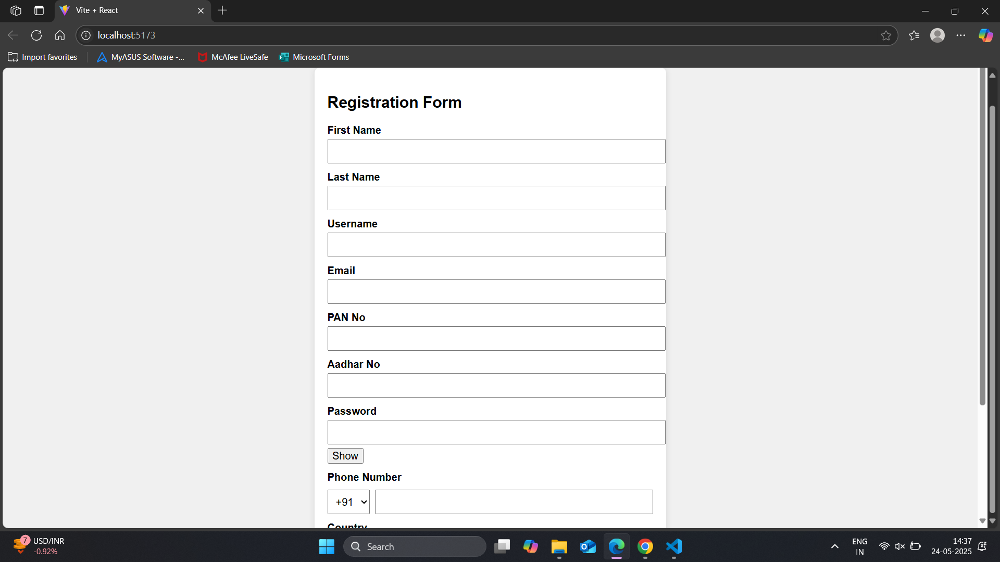

# 🌐 React Registration Form

A simple and responsive registration form built with **React**, featuring:

- Real-time form validation  
- Dynamic dropdowns (Cities by Country)  
- Password visibility toggle  
- Phone code selector  
- Success message popup on submission  

---

## 🚀 Features

- 🔍 **Validation**: Ensures all fields are filled correctly (e.g., email format, 12-digit Aadhar, 6+ character password).
- 🌍 **Dynamic Dropdowns**: Cities update automatically based on selected country.
- 🔒 **Password Toggle**: Easily show/hide password input.
- 📞 **Phone Input**: Includes country code selector for mobile number.
- ✅ **Success Message**: Displays submitted data after successful validation.

---

## 🛠️ Tech Stack

- React (with Hooks: `useState`)
- CSS (via `App.css`)
- JSX form rendering with error messages
- No external libraries (vanilla React)

---

## 📸 Screenshot

---

## 🎥 Live Demo

Watch the live demo on Loom:  
[

---

